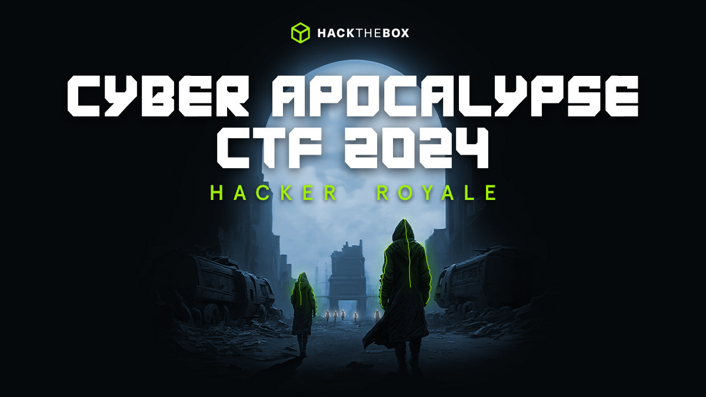

### Event Overview
“Dulu kita hidup damai dan punya cukup teknologi untuk membuat kita semua bahagia. Apa pendapat Anda tentang hal itu?

Disk data ini menyinggung "zaman keemasan masyarakat". Tidak ada perkelahian, tidak ada pengkhianatan, dan tidak ada faksi yang memperebutkan gelar yang buruk.

Bagus, bagus untuk mereka-

Karena yang bisa kita nantikan hanyalah "The Fray".

alarm berbunyi

Oh, lihat-... ini waktunya pertunjukan." (Kutipan: Luxx, pemimpin faksi Phreak)

💥 Selamat datang di "Kerebutan". Tantangan masyarakat yang dibuat oleh faksi paling licik, berdedikasi, dan haus darah. Kita semua terikat oleh aturan yang sama – jadilah salah satu faksi terakhir yang bertahan. Semua dipersembahkan kepada tuan dan sponsor Anda di KORP™.

Lampu-lampu kota kami mendatangkan orang-orang dari berbagai penjuru. Ini adalah salah satu bangunan besar terakhir yang tersisa setelah Divisi Besar terjadi. Namun, sejauh yang kami ketahui, KORP™ adalah satu-satunya yang pernah ada dan akan ada.

Mereka mengadakan The Fray setiap empat tahun untuk menemukan "yang terbaik dan tercerdas". Mereka yang berhasil melalui racikan tantangan teknologi mereka akan menjadi "Legioner", faksi yang didanai dan dapat duduk santai di antara pertarungan berikutnya.

### Tantangan Yang Diselesaikan
[Misc](Misc.md)

[Forensics](Forensics.md)

[Web](Web.md)

[Crypto](Crypto.md)

[Reverse](Reverse.md)