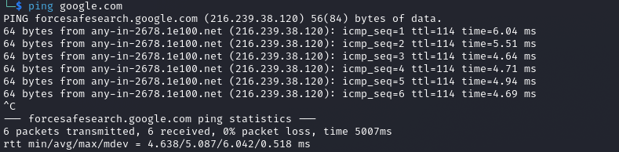

# writeups


## Ping Example

```bash
└─$ ping google.com     
PING forcesafesearch.google.com (216.239.38.120) 56(84) bytes of data.
64 bytes from any-in-2678.1e100.net (216.239.38.120): icmp_seq=1 ttl=114 time=6.04 ms
64 bytes from any-in-2678.1e100.net (216.239.38.120): icmp_seq=2 ttl=114 time=5.51 ms
64 bytes from any-in-2678.1e100.net (216.239.38.120): icmp_seq=3 ttl=114 time=4.64 ms
64 bytes from any-in-2678.1e100.net (216.239.38.120): icmp_seq=4 ttl=114 time=4.71 ms
64 bytes from any-in-2678.1e100.net (216.239.38.120): icmp_seq=5 ttl=114 time=4.94 ms
64 bytes from any-in-2678.1e100.net (216.239.38.120): icmp_seq=6 ttl=114 time=4.69 ms
^C
--- forcesafesearch.google.com ping statistics ---
6 packets transmitted, 6 received, 0% packet loss, time 5007ms
rtt min/avg/max/mdev = 4.638/5.087/6.042/0.518 ms
```


