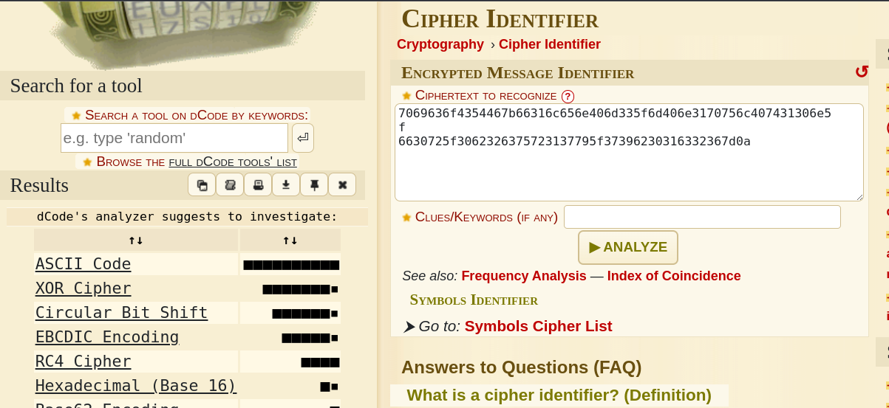
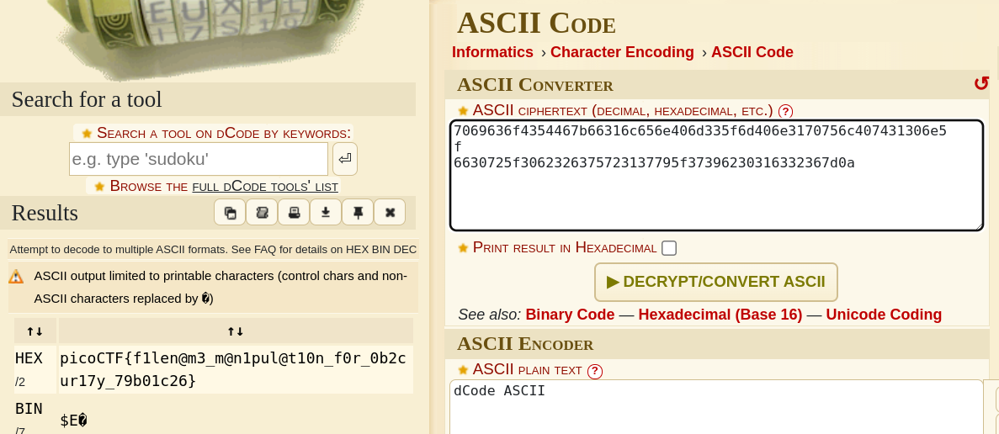

## Description
This file was found among some files marked confidential but my pdf reader cannot read it, maybe yours can.
You can download the file from here.

## Hints
Remember that some file types can contain and nest other files

## How to Solve

Cek file extension
```
┌──(free㉿free)-[~/CTF/picoCTF/Forensics/File types]
└─$ file Flag.pdf 
Flag.pdf: shell archive text
                              
```

File tersebut bukan pdf melainkan sebuah shell script. selanjutnya saya mengubah file tersebut menjadi .sh `mv Flag.pdf Flag.sh` dan menambahkan premission untuk di execute `chmod +x Flag.sh`

Setelah mengexecute file flag.sh, tantangan hanya berulang dari file yang di kompres dan extension nya yang di hapus.

```java
┌──(free㉿free)-[/picoCTF/Forensics/File types/unzip]
└─$ ./Flag.sh                      
x - created lock directory _sh00046.
x - extracting flag (text)
x - removed lock directory _sh00046.

──(free㉿free)-[/picoCTF/Forensics/File types/unzip]
└─$ ls ; file flag
flag  Flag.sh
flag: current ar archive
                                                                                                                                                                      
┌──(free㉿free)-[/picoCTF/Forensics/File types/unzip]
└─$ mv flag flag.ar | ar -x flag.ar
                                                                                                                                                                      
┌──(free㉿free)-[/picoCTF/Forensics/File types/unzip]
└─$ ls ; file flag                 
flag  flag.ar  Flag.sh
flag: cpio archive; device 234, inode 37426, mode 100644, uid 0, gid 0, modified Thu Mar 16 01:40:17 2023, 510 bytes "flag"
                                                                                                                                                                      
┌──(free㉿free)-[/picoCTF/Forensics/File types/unzip]
└─$ mv flag flag.cpio | cpio -iud < flag.cpio
zsh: no such file or directory: flag.cpio
                                                                                                                                                                      
┌──(free㉿free)-[/picoCTF/Forensics/File types/unzip]
└─$ ls            
flag.ar  flag.cpio  Flag.sh
                                                                                                                                                                      
┌──(free㉿free)-[/picoCTF/Forensics/File types/unzip]
└─$ cpio -iud < flag.cpio            
2 blocks
                                                                                                                                                                      
┌──(free㉿free)-[/picoCTF/Forensics/File types/unzip]
└─$ ls ; file flag                           
flag  flag.ar  flag.cpio  Flag.sh
flag: bzip2 compressed data, block size = 900k
                                                                                                                                                                      
┌──(free㉿free)-[/picoCTF/Forensics/File types/unzip]
└─$ mv flag flag.bz2 | bzip2 -d flag.bz2    
                                                                                                                                                                      
┌──(free㉿free)-[/picoCTF/Forensics/File types/unzip]
└─$ ls ; file flag                      
flag  flag.ar  flag.cpio  Flag.sh
flag: gzip compressed data, was "flag", last modified: Thu Mar 16 01:40:17 2023, from Unix, original size modulo 2^32 327
                                                                                                                                                                      
┌──(free㉿free)-[/picoCTF/Forensics/File types/unzip]
└─$ mv flag flag.gz | gzip -d flag.gz 
                                                                                                                                                                      
┌──(free㉿free)-[/picoCTF/Forensics/File types/unzip]
└─$ ls ; file flag                   
flag  flag.ar  flag.cpio  Flag.sh
flag: lzip compressed data, version: 1
                                                                                                                                                                      
┌──(free㉿free)-[/picoCTF/Forensics/File types/unzip]
└─$ mv flag flag.lz | lzip -d flag.lz
                                                                                                                                                                      
┌──(free㉿free)-[/picoCTF/Forensics/File types/unzip]
└─$ ls ; file flag                   
flag  flag.ar  flag.cpio  Flag.sh
flag: LZ4 compressed data (v1.4+)
                                                                                                                                                                      
┌──(free㉿free)-[/picoCTF/Forensics/File types/unzip]
└─$ mv flag flag.lz4 | lz4 -d flag.lz4
                                                                                                                                                                      
┌──(free㉿free)-[/picoCTF/Forensics/File types/unzip]
└─$ mv flag flag.lz4 | lz4 -d flag.lz4
Decoding file flag 
flag.lz4             : decoded 265 bytes                                       
                                                                                                                                                                      
┌──(free㉿free)-[/picoCTF/Forensics/File types/unzip]
└─$ ls ; file flag                    
flag  flag.ar  flag.cpio  flag.lz4  Flag.sh
flag: LZMA compressed data, non-streamed, size 254
                                                                                                                                                                      
┌──(free㉿free)-[/picoCTF/Forensics/File types/unzip]
└─$ mv flag flag.xz | xz -d flag.xz
                                                                                                                                                                      
┌──(free㉿free)-[/picoCTF/Forensics/File types/unzip]
└─$ ls ; file flag                 
flag  flag.ar  flag.cpio  flag.lz4  Flag.sh
flag: lzop compressed data - version 1.040, LZO1X-1, os: Unix
                                                                                                                                                                      
┌──(free㉿free)-[/picoCTF/Forensics/File types/unzip]
└─$ mv flag flag.lzo | lzop -d flag.lzo
                                                                                                                                                                      
┌──(free㉿free)-[/picoCTF/Forensics/File types/unzip]
└─$ ls ; file flag                     
flag  flag.ar  flag.cpio  flag.lz4  flag.lzo  Flag.sh
flag: lzip compressed data, version: 1
                                                                                                                                                                      
┌──(free㉿free)-[/picoCTF/Forensics/File types/unzip]
└─$ mv flag flag.lz | lzip -d flag.lz 
                                                                                                                                                                      
┌──(free㉿free)-[/picoCTF/Forensics/File types/unzip]
└─$ ls ; file flag                   
flag  flag.ar  flag.cpio  flag.lz4  flag.lzo  Flag.sh
flag: XZ compressed data, checksum CRC64
                                                                                                                                                                      
┌──(free㉿free)-[/picoCTF/Forensics/File types/unzip]
└─$ mv flag flag.xz | xz -d flag.xz
                                                                                                                                                                      
┌──(free㉿free)-[/picoCTF/Forensics/File types/unzip]
└─$ ls ; file flag                 
flag  flag.ar  flag.cpio  flag.lz4  flag.lzo  Flag.sh
flag: ASCII text
                                                                                                                                                                      
┌──(free㉿free)-[/picoCTF/Forensics/File types/unzip]
└─$ cat flag 
7069636f4354467b66316c656e406d335f6d406e3170756c407431306e5f
6630725f3062326375723137795f37396230316332367d0a


```

Let's identify this encryption first



Then Decrypt



