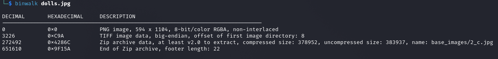
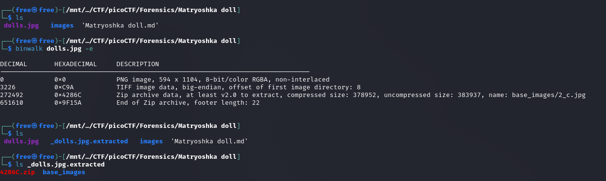

## Description

Matryoshka dolls are a set of wooden dolls of decreasing size placed one inside another. What's the final one? Image: this


## Hints
1. Wait, you can hide files inside files? But how do you find them?
2. Make sure to submit the flag as picoCTF{XXXXX}


## How to Solve

Seperti yang dikatakan dalam hints nomor 1 dengan kata kunci **"files inside files"**, untuk mencari informasi dari kata kunci tersebut apakah ada file di dalam file mari identikasi file dengan binwalk. 
```
binwalk dools.jpg
```



Setelah di identifikasi ternyata benar ada sebuah file di dalam dools.jpg. menggunakan `binwalk dools.jpg -e` untuk meng-extract file di dalam dools.jpg




Terlihat cukup banyak file yang di sembunyikan, dengan cara yang sama melakukan extract file dengan binwalk hingga muncul file flag.txt yang kita cari.

```
$ binwalk 2_c.jpg -e

DECIMAL       HEXADECIMAL     DESCRIPTION
--------------------------------------------------------------------------------
0             0x0             PNG image, 526 x 1106, 8-bit/color RGBA, non-interlaced
3226          0xC9A           TIFF image data, big-endian, offset of first image directory: 8
187707        0x2DD3B         Zip archive data, at least v2.0 to extract, compressed size: 196042, uncompressed size: 201444, name: base_images/3_c.jpg
383804        0x5DB3C         End of Zip archive, footer length: 22
383915        0x5DBAB         End of Zip archive, footer length: 22

$ ls
2_c.jpg  _2_c.jpg.extracted

$ binwalk _2_c.jpg.extracted/base_images/3_c.jpg -e 

DECIMAL       HEXADECIMAL     DESCRIPTION
--------------------------------------------------------------------------------
0             0x0             PNG image, 428 x 1104, 8-bit/color RGBA, non-interlaced
3226          0xC9A           TIFF image data, big-endian, offset of first image directory: 8
123606        0x1E2D6         Zip archive data, at least v2.0 to extract, compressed size: 77650, uncompressed size: 79807, name: base_images/4_c.jpg
201422        0x312CE         End of Zip archive, footer length: 22

$ binwalk _2_c.jpg.extracted/base_images/_3_c.jpg.extracted/base_images/4_c.jpg -e 

DECIMAL       HEXADECIMAL     DESCRIPTION
--------------------------------------------------------------------------------
0             0x0             PNG image, 320 x 768, 8-bit/color RGBA, non-interlaced
3226          0xC9A           TIFF image data, big-endian, offset of first image directory: 8
79578         0x136DA         Zip archive data, at least v2.0 to extract, compressed size: 63, uncompressed size: 81, name: flag.txt
79785         0x137A9         End of Zip archive, footer length: 22

$ cat _2_c.jpg.extracted/base_images/_3_c.jpg.extracted/base_images/_4_c.jpg.extracted/flag.txt
picoCTF{96fac089316e094d41ea046900197662} 
```