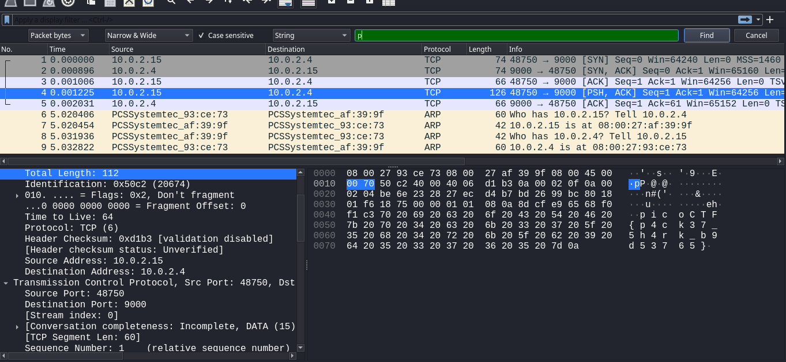

 
## Description

Download the packet capture file and use packet analysis software to find the flag.
Download packet capture

## Hints

Wireshark, if you can install and use it, is probably the most beginner friendly packet analysis software product.

## How to Solve

Melakukan pencarian pada string value dengan format flag `picoCTF`. awalnya pencarian dengan value tersebut tidak langsung di temukan karna adanya spasi di setiap huruf, hingga pencarian hanya menyisakan 1 huruf `p` dan langsung mengarah pada packet yang berisi flag.

