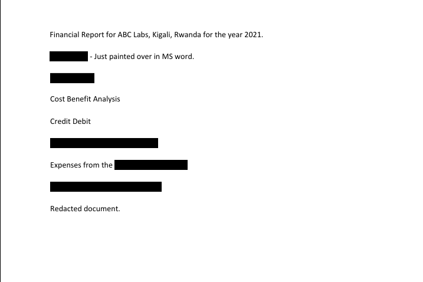

## Description

Now you DON’T see me.
This report has some critical data in it, some of which have been redacted correctly, while some were not. Can you find an important key that was not redacted properly?


## Hints

How can you be sure of the redaction?

## How to Solve

Document view




Convert PDF to txt

```
$ pdftotext Financial_Report_for_ABC_Labs.pdf output.txt
```

Catch the flag

```
┌──(free㉿free)-[picoCTF/Forensics/Redaction gone wrong]
└─$ cat output.txt | grep pico              
picoCTF{C4n_Y0u_S33_m3_fully}

```