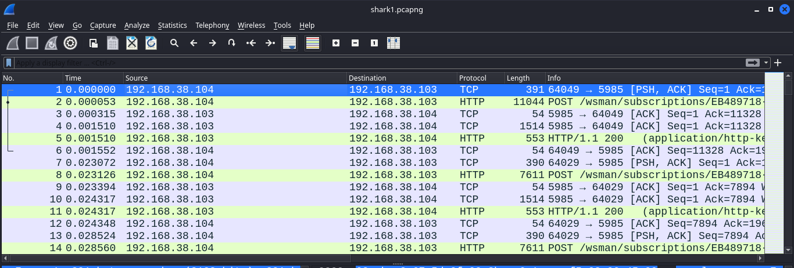
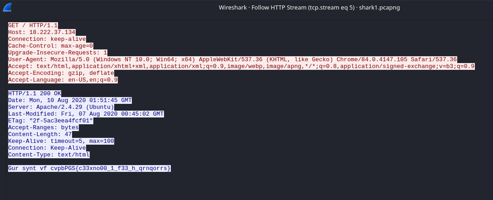
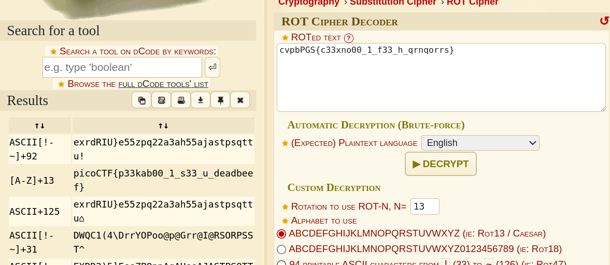

## Description

Can you find the flag? shark1.pcapng.

## Hints

**(None)**

## How to Solve

Pertama di saat membuka file shark1.pcapng yang menarik perhatian saya adalah protocol http seperti yang kita tau bahwa protocol http tidak ada pengamanan enkripsi

Setelah melakukan analisa terhadap packet tersebut dengan mengikuti http stream saya menemukan Line-based text data yang terlihat seperti format flag.

Hasil dari identifikasi dari teks tersebut adalah ROT Cipher

Langkah terakhir adalah dengan mendekripsi cipher tersebut 

