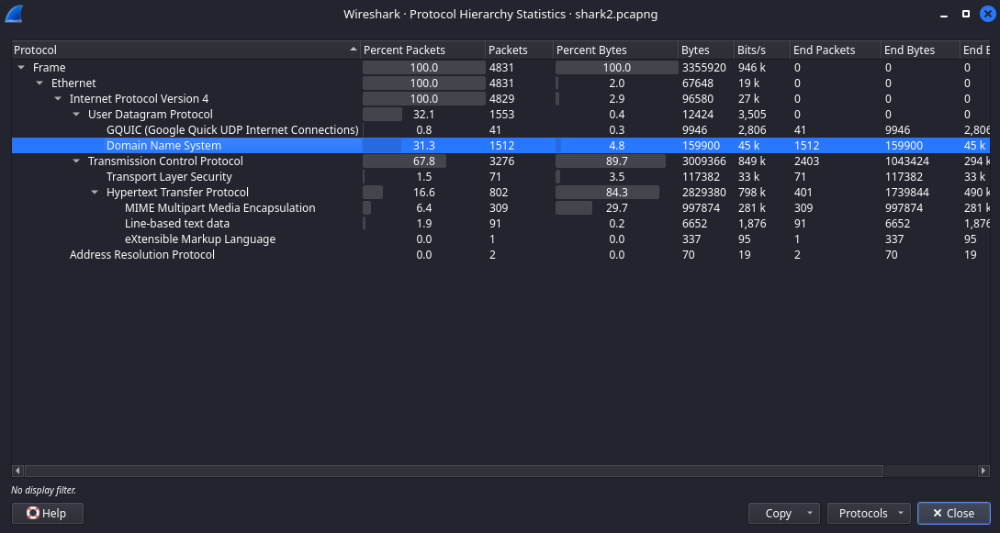

## Description 

Can you find the flag? shark2.pcapng.


## Hints 

1. Did you really find _the_ flag?
2. Look for traffic that seems suspicious.

## How to Solve

Setelah mencoba mencari pada protocol HTTP dan banyak sekali flag palsu. saya mengikuti petunjuk nomor 2 untuk mencari traffic yang mencurigakan. dengan membuka Protocol Hierarchy yang mana selain HTTP jumlah packet DNS juga cukup banyak.




Berdasarkan conversations pada protocol DNS yang hanya memiliki 2 alamat yang di tuju.

```
192.168.38.104 <-> 8.8.8.8
192.168.38.104 <-> 18.217.1.57
```
`8.8.8.8` adalah alamat DNS google yang mana tidak terlihat mencurigakan, saya melakukan filter address untuk mempersempit pencarian traffic.

```
(((dns)) && !(ip.dst == 8.8.8.8)) && !(ip.src == 8.8.8.8)
```


Pada query name bagian terakhir  terlihat **fQ==**  dari subdomain `fQ==.reddshrimpandherring.com` seperti pecahan struktur enkripsi base64. lalu pada bagian awal ada subdomain `cGljb0NU.reddshrimpandherring.com` **cGljb0NU** jika di decrypt menjadi **picoCT** yang terlihat seperti format flag. yang mana flag di sembunyikan di awalan subdomain dan di enkripsi menggunakan base64.


```java
┌──(free㉿free)-[/CTF/picoCTF/Forensics/Wireshark twoo twooo two twoo]
└─$ tshark -r shark2.pcapng -T fields -e dns.qry.name -Y "(((dns)) && !(ip.dst == 8.8.8.8)) && !(ip.src == 8.8.8.8)" | grep -oE "^[^.]*" | uniq
cGljb0NU
RntkbnNf
M3hmMWxf
ZnR3X2Rl
YWRiZWVm
fQ==
                                                                                                                                                                      
┌──(free㉿free)-[/CTF/picoCTF/Forensics/Wireshark twoo twooo two twoo]
└─$ tshark -r shark2.pcapng -T fields -e dns.qry.name -Y "(((dns)) && !(ip.dst == 8.8.8.8)) && !(ip.src == 8.8.8.8)" | grep -oE "^[^.]*" | uniq | base64 -d
picoCTF{dns_3xf1l_ftw_deadbeef}  

```
