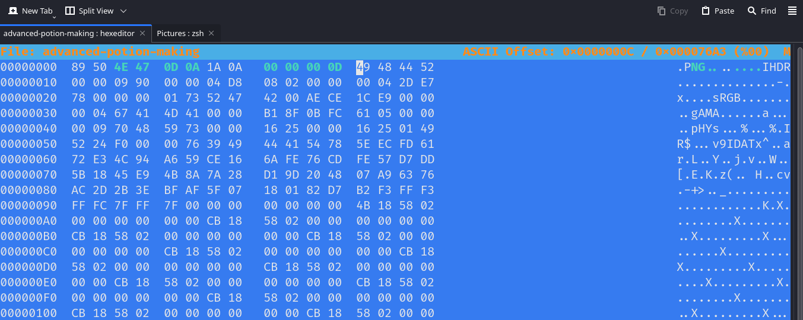
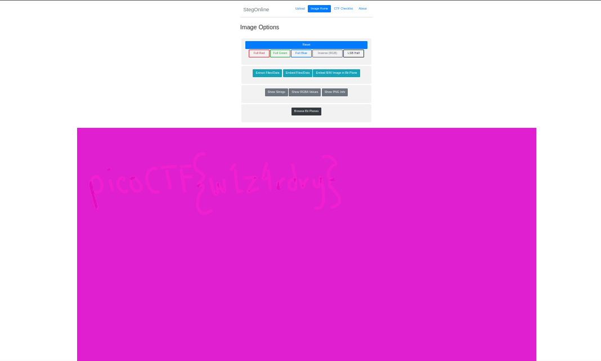

## Description 

Ron just found his own copy of advanced potion making, but its been corrupted by some kind of spell. Help him recover it!

## Hints 

**(None)**


## How to Solve

Seperti yang dikatakan di deskripsi bahwa file ini corrupt, mungkin terjadi karna tangan manusia atau ada yang mengubah nya. 
Terlihat pada header hex **89 50** yang menandakan format file **PNG** tetapi pada panel ASICII menandakan **.PB**  artinya file ini telah dirubah orang lain.
```
└─$ xxd -g 1 advanced-potion-making | head     
00000000: 89 50 42 11 0d 0a 1a 0a 00 12 13 14 49 48 44 52  .PB.........IHDR
00000010: 00 00 09 90 00 00 04 d8 08 02 00 00 00 04 2d e7  ..............-.
00000020: 78 00 00 00 01 73 52 47 42 00 ae ce 1c e9 00 00  x....sRGB.......
00000030: 00 04 67 41 4d 41 00 00 b1 8f 0b fc 61 05 00 00  ..gAMA......a...
00000040: 00 09 70 48 59 73 00 00 16 25 00 00 16 25 01 49  ..pHYs...%...%.I
00000050: 52 24 f0 00 00 76 39 49 44 41 54 78 5e ec fd 61  R$...v9IDATx^..a
00000060: 72 e3 4c 94 a6 59 ce 16 6a fe 76 cd fe 57 d7 dd  r.L..Y..j.v..W..
00000070: 5b 18 45 e9 4b 8a 7a 28 d1 9d 20 48 07 a9 63 76  [.E.K.z(.. H..cv
00000080: ac 2d 2b 3e bf af 5f 07 18 01 82 d7 b2 f3 ff f3  .-+>.._.........
00000090: ff fc 7f ff 7f 00 00 00 00 00 00 00 4b 18 58 02  ............K.X.

```

Untuk perbandingan ini adalah file signature dari PNG yang asli

```
└─$ xxd -g 1 test.png | head                      
00000000: 89 50 4e 47 0d 0a 1a 0a 00 00 00 0d 49 48 44 52  .PNG........IHDR
00000010: 00 00 01 90 00 00 01 90 08 06 00 00 00 80 bf 36  ...............6
00000020: cc 00 00 00 04 73 42 49 54 08 08 08 08 7c 08 64  .....sBIT....|.d
00000030: 88 00 00 1b 0b 49 44 41 54 78 9c ed dd 7b 9c 5c  .....IDATx...{.\
00000040: f3 fd c7 f1 f7 39 67 66 76 57 16 9b ab 0d 11 97  .....9gfvW......
00000050: b8 44 92 46 53 24 d1 26 41 84 90 94 2a d5 8b 56  .D.FS$.&A...*..V
00000060: 5d 5a aa a5 28 2d 2a 6e 11 a9 44 43 50 49 b4 24  ]Z..(-*n..DCPI.$
00000070: aa 68 b5 24 b4 ea 96 a8 e4 27 52 12 11 22 42 89  .h.$.....'R.."B.
00000080: 2a 51 49 90 ab 84 ec 5c ce 39 bf 3f 76 13 b3 b3  *QI....\.9.?v...
00000090: e7 cc cc 7e 36 ea 61 f7 f5 fc 8b 39 f3 9d 39 bb  ...~6.a....9..9.

```

Mengubah file signature advanced-potion-making bedasarkan file signature test.png

Setelah dirubah file akan terlihat seperti ini


setelah recovery berhasil saya membuka file tersebut di dalam stegsolve online untuk melakukan visual analisis dan melihat mungkin ada flag yang di sembunyikan .

