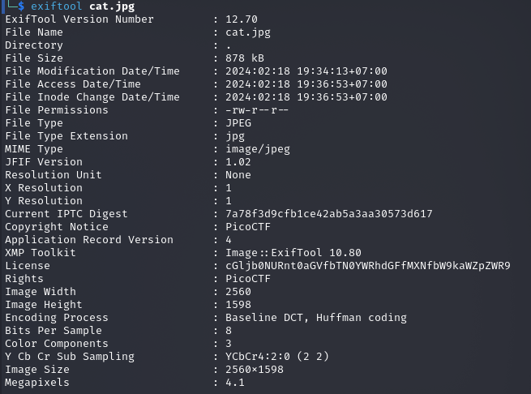
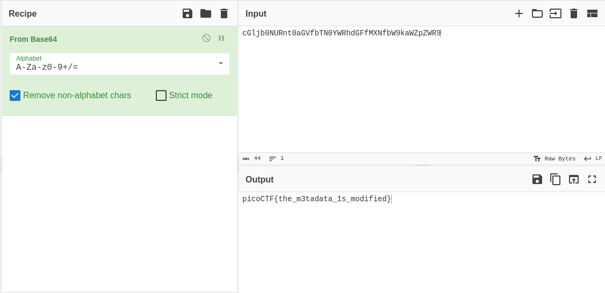

## Description
Files can always be changed in a secret way. Can you find the flag? cat.jpg

Here is the cat.jgp file look like

## Hints
- Look at the details of the file
- Make sure to submit the flag as picoCTF{XXXXX}

## How to Solve
1. Cek metadata menggunakan command exiftool
   
   > exiftool cat.jpg

   

   Terlihat pada bagian license ada data yang di modifikasi menjadi sebuah enkripsi type base64 
   
2. Decrypt Base64 menggunakan cyberchef
   
   

FLAG : picoCTF{the_m3tadata_1s_modified}